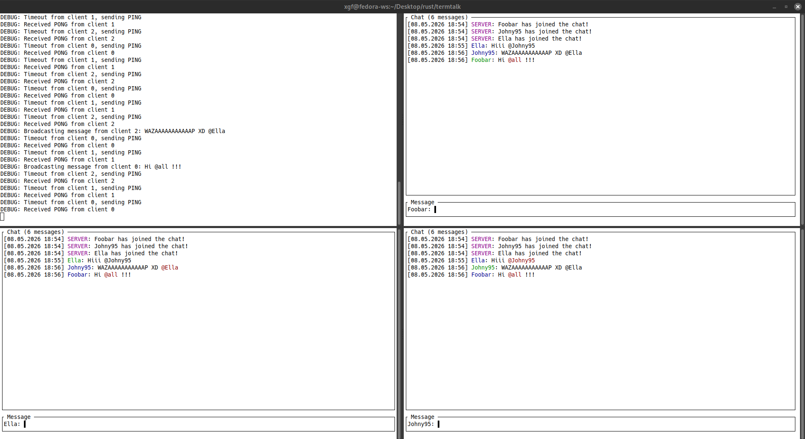

# **TermTalk: A Terminal-Based Chat Application in Rust**

[](https://opensource.org/licenses/MIT) 
[](https://github.com/Peter-L-SVK/TermTalk)
[](https://github.com/Peter-L-SVK/TermTalk/releases/latest)
[](https://github.com/Peter-L-SVK/TermTalk/commits/main)

This repository contains a **terminal-based chat application** built in Rust, leveraging asynchronous programming and multithreading for real-time communication. The application consists of a **server** and a **client**, allowing multiple users to connect and chat in a shared terminal environment. You can run several separate terminal clients and emulate users talking. Created and tested on Fedora 42. The development is still ongoing and will continue for the time being. This is a hobby project of mine and a proof of concept rather than a proper application.

---

## **Screenshot**

Here is a screenshot of TermTalk in action (terminal used in the picture: [Terminator](https://gnome-terminator.org/)):


   
But you can use any terminal emulator.


---

## **Release Notes**

### **New Features in Version 0.8**
- As of version 0.8, moved to: [Release Notes](https://github.com/Peter-L-SVK/TermTalk/releases)

### **New Features in Version 0.5**
- **New UI functionality**: Now you can see list of active users by pressing Ctrl+L.
- **Reworked logic**: Now instead of redundant code everything is in utils lib and logging.
- **UI improvements**: Interface now prompting which key is for quit or return from user list.

### **New Features in Version 0.3**
- **Improved UI Responsiveness**: Optimized the terminal interface for smoother updates.
- **Improved mention highlighting**: Now tag @all is highlighted for all logged in users.
- **Username check**: Server now checks if logging in username is already online and prompts user for new one.
- **Enhanced Error Handling**: Improved error messages for better debugging.
- **Code Optimization**: Reduced redundant processing for better performance.

---

## **Terminal Theming**

TermTalk uses your terminal's default colors for all standard text (timestamps, regular messages, UI elements). Only specific elements like usernames, server messages, and @mentions are explicitly colored by the application. This means you control the overall look and feel through your terminal emulator's settings:

- **Background color**: Set in your terminal preferences
- **Foreground/text color**: Set in your terminal preferences  
- **UI borders and standard text**: Inherits your terminal theme

The application only overrides colors for:
- 🟢 Your username (green)
- 🔵 Other users' names (blue)
- 🟣 Server messages (magenta)
- 🔴 @mentions and @all (red)

This design keeps TermTalk lightweight and ensures it integrates seamlessly with whatever terminal color scheme you prefer.

---

## **Features**
- **Run scripts for server and client**: Scripts will build apps using `cargo run` <br />If the project is built already, they will run only binaries.
- **Real-time messaging**: Send and receive messages instantly with other connected users.
- **Asynchronous I/O**: Built using `tokio` for efficient handling of multiple clients.
- **Terminal UI**: Clean and intuitive terminal interface powered by `tui` and `crossterm`.
- **Mention highlighting**: Mentions (e.g., `@username` and `@all`) are highlighted in red bold for better visibility.
- **User list view**: Press Ctrl+L to see all connected users, press 'r' to return to chat.
- **Ping-Pong mechanism**: Ensures clients remain connected to the server.
- **Mouse wheel scrolling**: Navigate through chat history using mouse or keyboard.
- **Message buffering**: No lost messages when switching between views.
- **Colored usernames**: Your messages appear in green, others in blue, server messages in magenta.
- **Keyboard shortcuts**: Comprehensive keyboard navigation for power users.

---

## **Keyboard Shortcuts**

| Shortcut | Action |
|----------|--------|
| `Ctrl+L` | Show user list |
| `r` | Return to chat from user list |
| `↑` / `↓` | Scroll through messages |
| `Page Up` / `Page Down` | Scroll 5 lines at a time |
| `Home` | Jump to top of messages |
| `End` | Jump to latest messages |
| `Scroll Wheel` | Scroll through messages |
| `Enter` | Send message |
| `Backspace` | Delete character |
| `Esc` | Quit application |

---

## **How It Works**
The application is divided into two components:
1. **Server**: Manages client connections, broadcasts messages, and handles disconnections.
2. **Client**: Connects to the server, sends messages, and displays the chat interface.

Messages are broadcast to all connected clients in real-time, with timestamps and colored usernames for clarity.

---

## **System Requirements**
- **Rust and Cargo**: Ensure you have Rust installed. If not, install it from [rustup.rs](https://rustup.rs/).
- **Unix-like environment**: Tested on **Fedora 42**, but should work on other Linux distributions, macOS and FreeBSD.

---

## **How to Run**

### 1. Clone the Repository
```bash
git clone https://github.com/Peter-L-SVK/termtalk.git
cd termtalk
```

### 2. Build the Project
The included BASH scripts will also build the apps and run the binaries or build them straight away:
```bash
cargo build --release
```

### 3. Start the Server
You can run the included BASH server script to run the server on your machine or:
```bash
./target/release/server
```
The server will start listening on `127.0.0.1:8080` by default or the configured address.

### 4. Start the Client
In a new terminal, you can run the included BASH script for running the client or start the client manually:
```bash
./target/release/client
```
You will be prompted to enter a username. Once connected, you can start chatting!

---

## **Configuration**

### Change the server IP/port
Modify the configuration file `config.toml`:
```toml
server_address = "127.0.0.1:8080"
```

### Modify the terminal UI
Adjust the layout and styling in `client.rs` using the `tui` crate.

---

## **Project Structure**
```
termtalk/
├── src/
│   ├── client.rs     # Client-side TUI application
│   ├── server.rs     # Server-side connection handler
│   ├── lib.rs        # Shared client handling logic
│   ├── utils.rs      # Utility functions and message formatting
│   └── logging.rs    # File-based logging utilities
├── Cargo.toml        # Project dependencies and metadata
└── README.md         # Project documentation
```

---

## **Dependencies**
This project uses the following Rust crates:

- **tokio**: Asynchronous runtime for networking.
- **tui**: Terminal user interface library.
- **crossterm**: Cross-platform terminal handling.
- **chrono**: Timestamp formatting.
- **colored**: Colored text output (used for server-side logging).

---

## **License**
MIT License - Copyright (c) 2025-2026 Peter Leukanič

See the [LICENSE](LICENSE) file for details.
